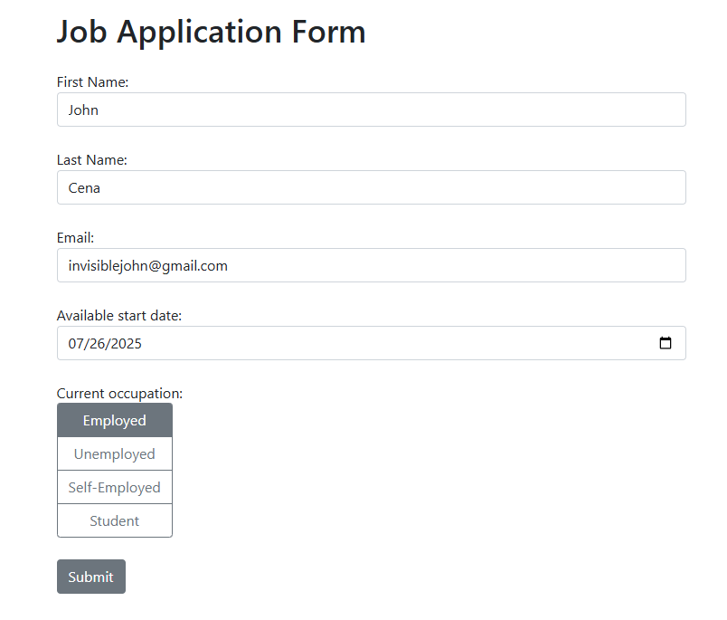
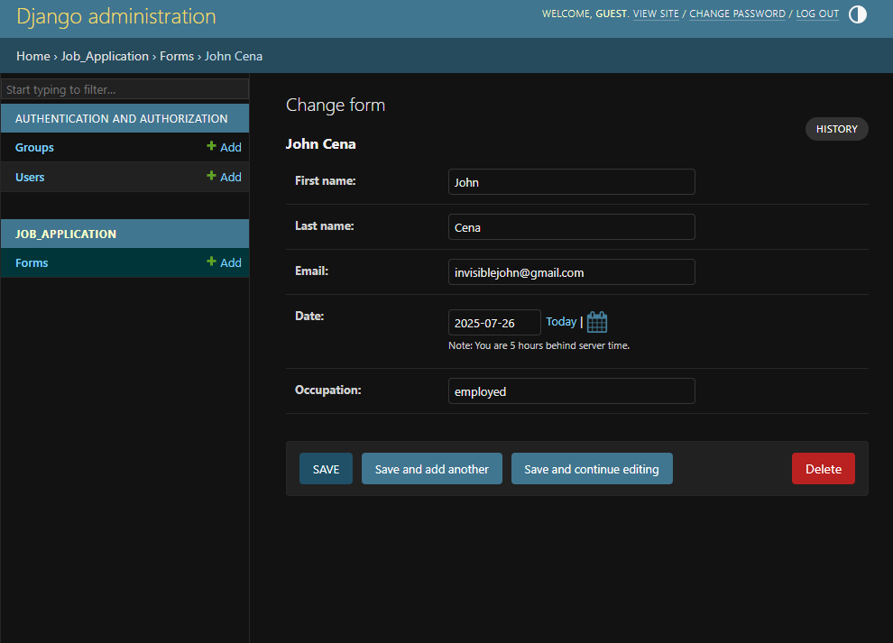
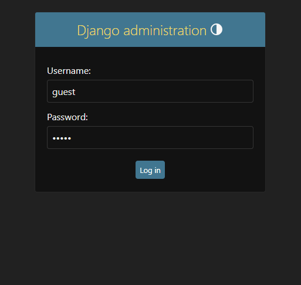

## Job Application Form (Django)

Django-based job application portal that allows users to submit personal and employment details. The system includes an admin interface, Bootstrap styling, and secure data handling.

<br>



## Features

- Django-powered backend with SQLite database
- Application form with CSRF protection and validation
- Admin interface to view and manage submissions
- Bootstrap 5 styling for responsive UI
- Navigation bar and structured templates

## Screenshots


### Admin Panel


### Admin Login


## Tech Stack

- Python 3.x
- Django 4.x
- Bootstrap 5
- HTML/CSS (with Django template engine)

## Setup Instructions

1. **Clone the repository**
   ```bash
   git clone https://github.com/yourusername/job-application-form-django.git
   cd job-application-form-django
   ```

2. **Create and activate a virtual environment**
   ```bash
   python -m venv venv
   source venv/bin/activate    # On Windows: venv\Scripts\activate
   ```

3. **Install dependencies**
   ```bash
   pip install -r requirements.txt
   ```

4. **Run migrations**
   ```bash
   python manage.py migrate
   ```

5. **Create a superuser (optional)**
   ```bash
   python manage.py createsuperuser
   ```

6. **Run the development server**
   ```bash
   python manage.py runserver
   ```

7. **Access the app**
   - Frontend: [http://localhost:8000/](http://localhost:8000/)
   - Admin: [http://localhost:8000/admin/](http://localhost:8000/admin/)

## Developer

**Tobi Emmanuel**  
[oluwatobiemmanuel.com](https://oluwatobiemmanuel.com)

## License

This project is licensed under the [MIT License](LICENSE).